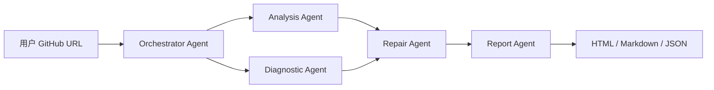
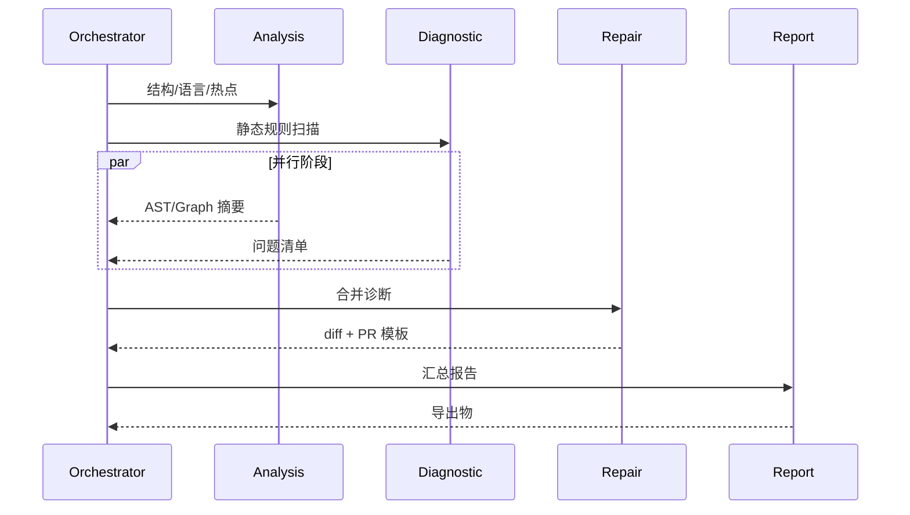
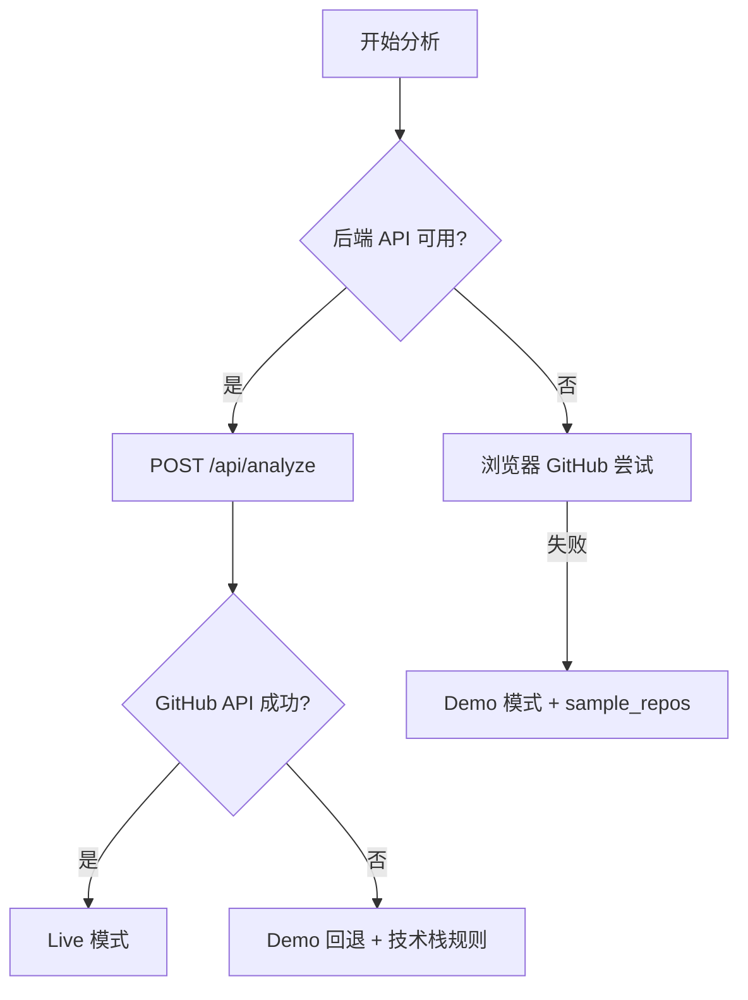

# Multi-Agent 架构图（Mermaid）

## 总览流程

```mermaid
flowchart LR
  U[用户 GitHub URL] --> O[Orchestrator Agent]
  O --> A[Analysis Agent]
  O --> D[Diagnostic Agent]
  A --> R[Repair Agent]
  D --> R
  R --> P[Report Agent]
  P --> OUT[HTML / Markdown / JSON]
```

## 并行调度

```mermaid
sequenceDiagram
  participant O as Orchestrator
  participant A as Analysis
  participant D as Diagnostic
  participant R as Repair
  participant P as Report
  O->>A: 结构/语言/热点
  O->>D: 静态规则扫描
  par 并行阶段
    A-->>O: AST/Graph 摘要
    D-->>O: 问题清单
  end
  O->>R: 合并诊断
  R-->>O: diff + PR 模板
  O->>P: 汇总报告
  P-->>O: 导出物
```

## Live / Demo 模式

```mermaid
flowchart TD
  START[开始分析] --> TRY{后端 API 可用?}
  TRY -->|是| API[POST /api/analyze]
  API --> GH{GitHub API 成功?}
  GH -->|是| LIVE[Live 模式]
  GH -->|否| DEMO1[Demo 回退 + 技术栈规则]
  TRY -->|否| BROWSER[浏览器 GitHub 尝试]
  BROWSER -->|失败| DEMO2[Demo 模式 + sample_repos]
```
